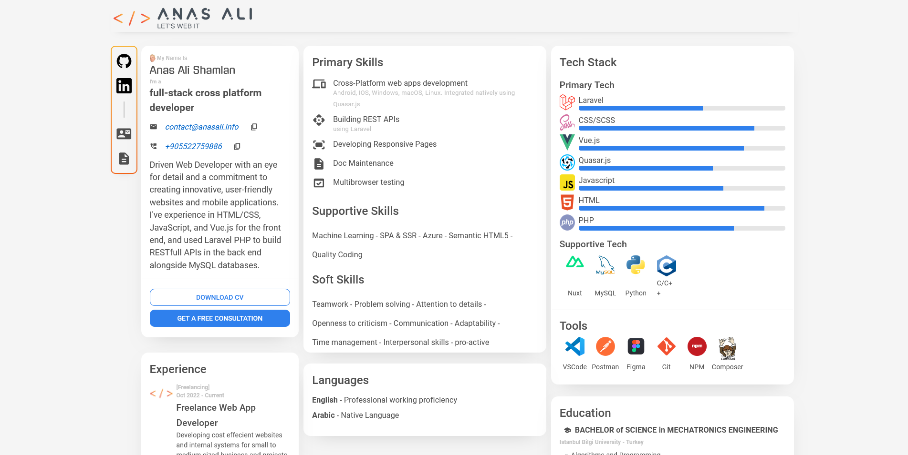
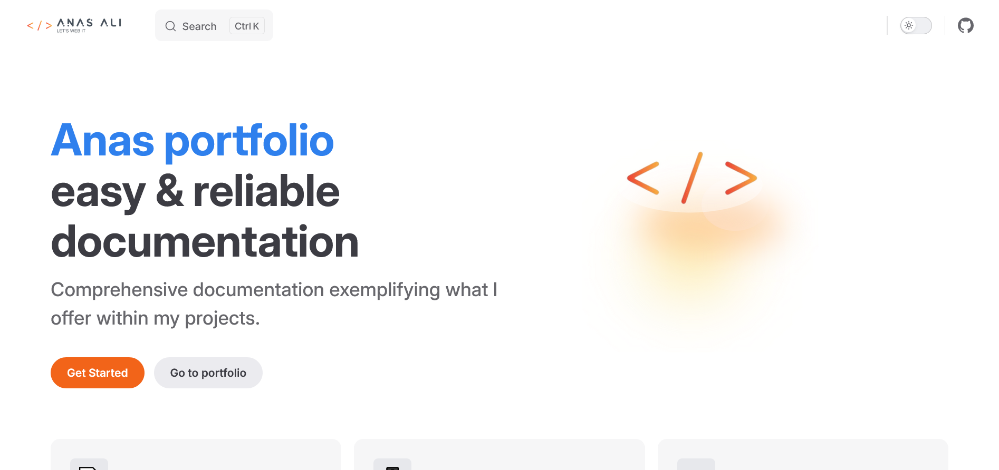

# My Portfolio Website

This repository contains the frontend source code for my personal portfolio website. Here you can find examples of my work, experience, and skills.

## Live site:

[dev.anasali.info](https://dev.anasali.info/)


## Documentation

[docs.anaslai.info/front-end](https://docs.anasali.info/frontend/)


## Features:

- 📑 Skimmable Portfolio Content
  - Designed and structrued to be easly scaned in seconds.
- 📱 Stand By Compatibility
  - Cross platform combatible codebase for mobile & desktop
- 🖵 Highly Dynamic
  - Dynamic data preveiws fetched from backend

---

## Main Technologies Used:

- [Vue.js](https://vuejs.org/)
- [Quasar Framework](https://quasar.dev/)
- [Capacitor.js](https://capacitorjs.com/)
- [Axios](https://axios-http.com/)
- [Swiper](https://swiperjs.com/)
- [Pinia](https://pinia.vuejs.org/)
- [Vitepress](https://vitepress.dev/)

---

## Setup and Installation:

### Prerequisites:

Quasar CLI is used for this project please install it first, for more details click [here](https://docs.anasali.info/front-end/guid/getting-started#prerequisites).

> [!IMPORTANT]
> Quasar Cli requirements
>
> - Node 14+ for Quasar CLI with Vite.
> - Yarn v1 (strongly recommended), PNPM, or NPM..

to install it run this command

```bash
npm i -g @quasar/cli
```

### Clone / Fork

```bash
git clone https://github.com/anas-cd/anasali.info-frontend.git
# - or -
git fork https://github.com/anas-cd/anasali.info-frontend.git
```

### Installation:

I recommend visiting the [getting started guid](https://docs.anasali.info/front-end/guid/getting-started#setup-projects) for a better idea but tl;dr

```bash
bash install-packs.sh
# - or -
chmod u+x install-packs.sh
.\install-packs.sh
```

> [!WARNING]
> Your IDE terminal may not recognize "bash" or "chmod", a quick solution is to run it using [Git BASH](https://gitforwindows.org/), you can run `bash install-packs.js` directly or run `chmod u+x install-packs.sh` then you can run `.\install-packs.sh` from the IDE terminal.

---

## Development:

### Starting the Development Server:

- for SPA mode

```bash
quasar dev
```

- for Capacitor mode

```bash
quasar dev -m capacitor -T android
# - or -
quasar dev -m capacitor -T ios
```

---

## Author

Name: Anas Shamlan
Website: [https://dev.anasali.info](https://dev.anasali.info/)
GitHub: [https://github.com/anas-cd](https://github.com/anas-cd)
LinkedIn: [https://www.linkedin.com/in/anas-shamlan/](https://www.linkedin.com/in/anas-shamlan/)
