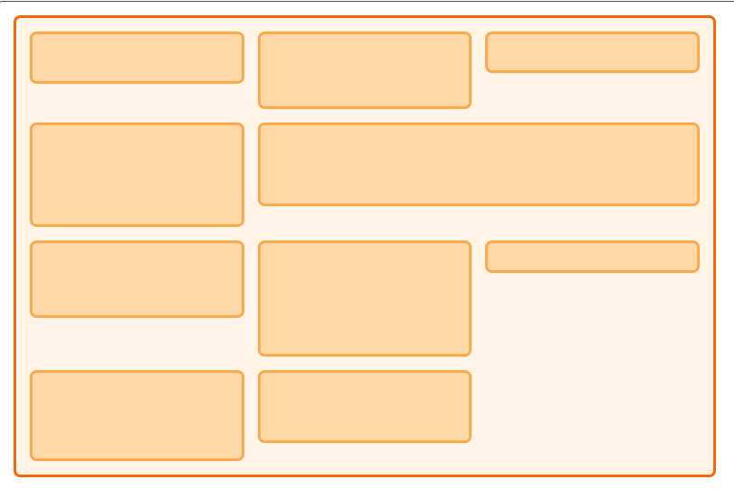
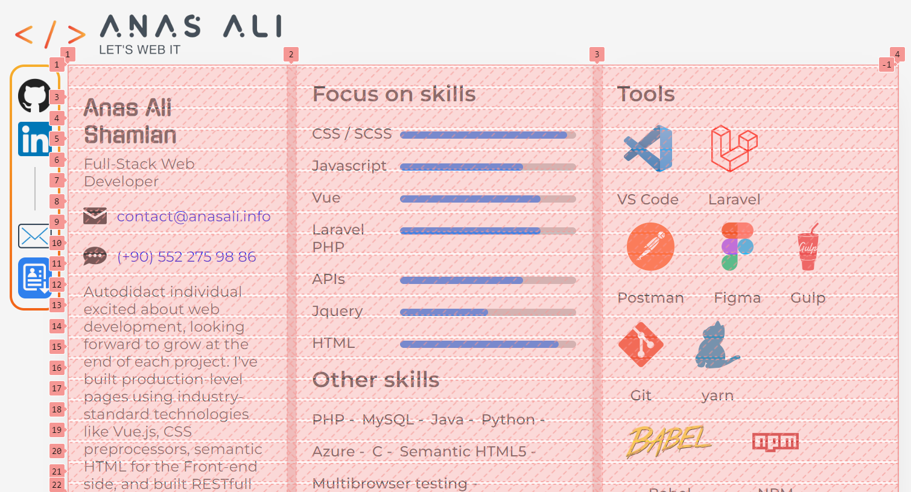

---
# YAML Frontmatter properties
---

# CVPage

```
.
├─ pages/
|   └─ MainPage/
|     └─ CVPage.vue
```

This is the main page of this site, it's designed to be skimmed in seconds by using multiple techniques

- sections are minified to be contained in a card like containers
- sections (cards) are arranged to show the most important info to a client/recruiter

this means instead of making section components under the [sections directory](/components/structure.md#%E2%94%9C%E2%94%80-sections) this page must have a complete unique set of section components to be represented as cards.

## Card Arrangements

::: danger
**TL;DR:**

Avoid placing a single-columned element after an element spanning multiple columns. If necessary, ensure it's only placed in the first column the previous element spans from.

The arrangement follows a hierarchy: column 1 takes precedence, then 2, then 3. However, this method is flawed and can lead to overlaps. For example, if an element spanning multiple columns is followed by an element spanning the lowest row count column, an overlap may occur.

Consider this scenario: Column 2 has 25 rows, and Column 3 has 10. If a new element spanning 10 rows occupies Columns 2 and 3, and Column 2 ends up with 35 taken rows while Column 3 has a gap between 10 and 25 rows, another card of 20 rows spanning only Column 3 will start from row 10. This overlap happens because the added number of rows in the `takenRows` variable is attributed to the highest column before adding the element (Column 2 in this case).

While the current code is sufficient, a more robust solution involves implementing start and end row counters for each column. This would allow checking if a new element in Column 3 can fit in the free gap.

This enhancement is on the **TODO** list to create a Masonry Layout package.
:::

The layout we're using is called 'Masonry Layout' and it's created with CSS grid. However, using CSS grid alone won't achieve the desired result, as elements won't stack up properly in each column. Instead, elements will start at the end of the largest element on the previous row, regardless of whether it's in the same column or not. This can be seen in the image below.



To make the layout dynamic and allow the cards to start where the last one ended, we use a combination of CSS Grid and JavaScript. First, we create a grid with three columns and an auto-generated large number of very small rows for each column using CSS.

::: code-group

```vue [CVPage.vue]
<style lang="scss">
.q-page {
  grid-auto-rows: 3px; // [!code focus:3] // pixels per row,
  // the smaller it is the finer the positioning gets,
  // but too small and it will take unnecessary computational power
  column-gap: 10px;
  row-gap: 20px;
}
</style>
```

:::

which will end up looking like so:



after that we can use JS to figure out how many rows each card should occupy in each column, here is the breakdown for each part (CSS & JS)

### CSS

a CSS grid is used to arrange which card goes to which column, currently the grid is hard coded to only have 3 columns max

::: code-group

```vue{3} [CVPage.vue]
<style lang="scss">
.q-page {
  grid-template-columns: 1.3fr 2fr 2fr; // 3 columns

  /* -- semi-responsive config -- */
  @media #{$mq-1024-down} {
    grid-template-columns: 1fr 1fr 0fr; // 2 columns
  }
  @media #{$mq-768-down} {
    grid-template-columns: 1fr 0fr 0fr; // 1 column
  }
}
</style>
```

:::

now that we have the number of columns figured out we can arrange the cards by picking which card should go to which column

::: code-group

```vue{2} [CVPage.vue]
<template>
  <div class="cell profile-cell">
    ...
  </div>
</template>
<style lang="scss">
.q-page {
  // -- cells columns positioning classes --
  .profile-cell {
    // - setting the profile card/cell to the first column -
    grid-column-start: 1;
    grid-column-end: 2;

    @media #{$mq-1024-down} {
      grid-column-start: 1;
      grid-column-end: 2;
    }
  }
  ...
  .cell {
    ...
    /* -- semi-responsive config for all cells -- */
    @media #{$mq-768-down} {
      grid-column-start: 1;
      grid-column-end: 4;
    }
  }
}
</style>
```

:::

after we choose which card goes in which column we then use JS to set where it should start from

### JS

we have three main functions to fit cards in the correct spot,

- `resizeAllGridItems()`
- `fitItem()`
- `getHighestIndex()`

#### step 1

the process starts by calling **`resizeAllGridItems()`**, this function keeps track of how many cards are in each row, and gets all the elements that should be fitted in

::: code-group

```js [CVPage.vue]
/* -- resizeAllGridItems() -- */
// each index represents how many cards are in a column
let takenRows = [1, 1, 1];

/* - step 1 -*/
// every element with class 'cell' will be fitted in the grid
let allItems = document.getElementsByClassName("cell");
```

:::

#### step 2

looping through each element to figure out which column it is assigned to by CSS using the JS `getComputedStyle()` function like so

::: code-group

```js [CVPage.vue]
/* -- resizeAllGridItems() -- */
let CStart = getComputedStyle(allItems[x]).gridColumnStart; // set via CSS for each component
let CEnd = getComputedStyle(allItems[x]).gridColumnEnd; // set via CSS for each component
```

:::

#### step 3

using `if else` statements we check which column the element assigned to

::: code-group

```js [CVPage.vue]
/* -- resizeAllGridItems() -- */
if (CStart == 1 && CEnd == 2) {
  // -- if spanning only column 1 --
  // --- step 4 ---
} else if (CStart == 1 && CEnd == 4) {
  // -- if spanning multiple columns --
  // --- step 4 ---
} ...
```

:::

#### step 4

the starting row number is assigned by checking the taken rows in that column, or by getting the biggest row number if an element is spanning multiple columns using `getHighestIndex()`

::: code-group

```js [CVPage.vue]
/* -- resizeAllGridItems() -- */
if (CStart == 1 && CEnd == 2) {
  // -- if spanning only column 1 --
  startingRowNumber = takenRows[0]; // index of this first column is '0'
} else if (CStart == 1 && CEnd == 4) {
  // -- if spanning multiple columns --
  // - getting the biggest row number as a starting point (so the item starts from the latest item in all fields and doesn't overlap) -
  startingRowNumber = Math.max(takenRows[1], takenRows[2]);

  // - getting the index of the biggest row number -
  let takenRowsIndex = getHighestIndex(takenRows, [1, 2]);// [!code error] // produces flaws in arrangement, please read the DANGER note


} ...
```

:::

#### step 5

By using the `fitItem()` function, you can fit the item and determine the total rows taken. The function accepts the "item" element and the starting row number "startingRowNumber" as parameters.

::: code-group

```js [CVPage.vue]
function fitItem(item, startingRowNumber) {
  let gridContainer = document.getElementById("cv-grid");
  let rowHeight = parseInt(
    // set via CSS
    window.getComputedStyle(gridContainer).getPropertyValue("grid-auto-rows"),
  );
  let rowGap = parseInt(
    // set via CSS
    window.getComputedStyle(gridContainer).getPropertyValue("grid-row-gap"),
  );
  let rowSpan = Math.ceil(
    // how many rows the elements should take
    (item.getBoundingClientRect().height + rowGap) / (rowHeight + rowGap),
  );
  // [!code focus:6]
  let RStart = startingRowNumber;
  let REnd = startingRowNumber + rowSpan;
  item.style.gridRowStart = RStart;
  item.style.gridRowEnd = REnd;
  return REnd; // returning the current row number
}
```

:::

#### step 6

save the returned row as the highest in that column

::: code-group

```js [CVPage.vue]
/* -- resizeAllGridItems() -- */

// will return the updated number of rows taken
takenRows[0] = fitItem(allItems[x], startingRowNumber);

// -- or for multiple columns --
takenRows[takenRowsIndex] = fitItem(allItems[x], startingRowNumber); // [!code error] // produces flaws in arrangement, please read the DANGER note
```

:::

## Data Fetching And Rendereing

The data fetching process starts from here

```vue
<script setup>
import { usePortfolioStore } from "src/stores/portfolio";

const store = usePortfolioStore();

store.fetchData(); // [!code focus]
</script>
```

this will fetch all card info from different APIs and then populate the states data containers. cards components will not get rendered unless data is available in the corresponding state container using the `v-if` Vue conditional directive

```vue
<template>
  <!-- [!code focus:2] -->
  <component v-if="store.componentData"></component>
  <!-- using Quasar element "q-skeleton" for user feedback (optional) -->
  <q-skeleton v-else height="620px" width="100%"></q-skeleton>
</template>
```
